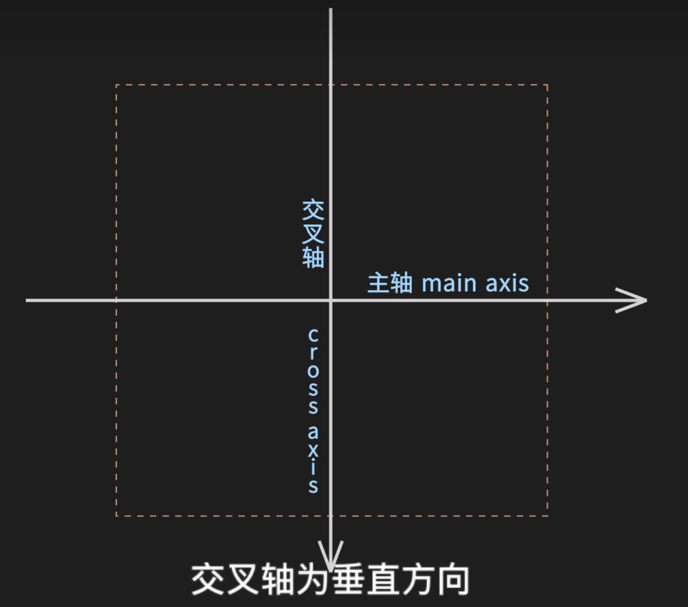

# flex 布局

主轴方向，默认为水平

1. flex-direction
2. flex-wrap
3. flex-flow

## 主轴上的对齐方式

justify-content:

1. flex-start
2. center
3. flex-end
4. space-around
5. space-between
6. space-evnly

## 交叉轴上的对齐方式

 align-item

 1. flex-start
 2. flex-end
 3. center

## css选中子元素

:nth-child(an+b)

:nth-of-type(an+b)

## 设置多行容器在交叉轴上的对齐方式

align-content

## 设置单个项目在交叉中上的对齐方式

align-self

## 主轴上的放大、缩小因子

flex-grow、flex-shrink

## 设置项目在主轴上的计算基准尺寸

flex-basis

